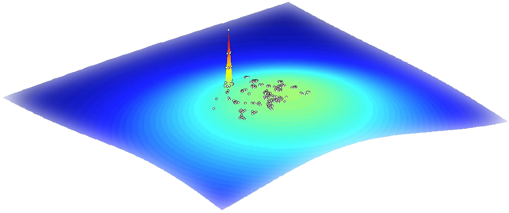
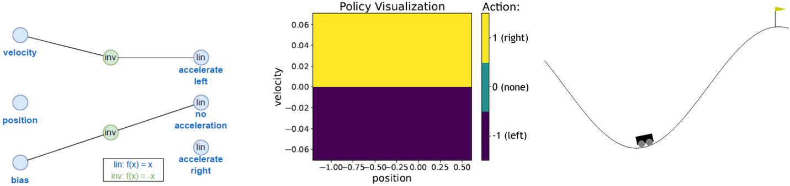

# Exploring Sparse Reward Environments with Weight Agnostic Neural Networks


## 🚀 Overview
Sparse reward environments present a significant challenge in reinforcement learning (RL), as agents receive little to no feedback for extended periods, making effective learning difficult. Traditional RL algorithms struggle in these settings without human-engineered feedback to guide training.

### **Why Sparse Rewards Matter?**
Many real-world RL applications provide only sparse rewards, requiring the algorithm to find a "needle in the haystack" solution. Challenges include:
- **Delayed Feedback:** Agents receive rewards only upon completing a task, making it hard to assign credit.
- **Exploration Difficulty:** Standard RL approaches struggle to find rare trajectories that lead to rewards without guidance.

<p align="center">
  
</p>

### **Our Approach: WANNs for Sparse RL**
We explore a novel direction using **Weight Agnostic Neural Networks (WANNs)**, which leverage evolutionary search to discover network architectures for solving such tasks.

We evaluate WANNs on modified versions of the **MountainCar** and **LunarLander** environments, where rewards are only given upon successful task completion. Our results demonstrate that WANNs can successfully learn compact, interpretable policies in these settings, whereas conventional RL methods fail without reward shaping!

---
## 📊 Results
### **Discovered WANN Network and Policy**
Example solution: the best WANN model for the discrete Sparse Mountain Car (SMC) task learns an effective and interpretable policy:

<p align="center">
  
</p>

### **Performance Comparison**
| Method     | SMC Discrete | SMC Continuous | Lunar Lander |
|------------|-------------|----------------|--------------|
| **WANN**   | **123.92**  | **136.73**     | **1135.37**  |
| Q-Learning | ∞ (110.53)  | ∞ (∞)          | ∞            |
| PPO        | ∞ (133.27)  | ∞ (224.25)     | ∞            |
| DQN        | ∞ (322.79)  | ✗              | ∞            |

*Average time steps to reach the goal;∞ denotes failure to reach the goal; values in parentheses indicate performance with reward shaping applied.*

---

## 📌 Key Takeaways
✅ **WANNs succeed where standard RL fails** in sparse environments.  
✅ **No reward shaping required**, reducing manual effort.  
✅ **Compact, interpretable networks** discovered via evolutionary search.  

---
## 📂 Directory Structure
```
.
├── wann_train.py        # Evolutionary search for networks solving the task
├── wann_test.py         # Evaluation and visualization of trained WANNs
├── visualizer.py        # Network structure and policy visualization tool
├── pareto_front.py      # Displays the Pareto front (fitness vs. complexity)
├── Sparse-RL-WANN.pdf   # Project report summary
│
├── wann_src/            # Helper functions for WANN EA process
├── p/                   # JSON config files for experiment parameters
├── domain/              # Task environments
├── champions/           # Best evolved models stored here
├── RL/                  # PPO, DQN, and Q-Learning implementations
│
└── requirements.txt      # Required dependencies
```

---

## 🛠 Installation
Clone this repository and install dependencies:
```bash
git clone https://github.com/Tobi-Tob/Sparse-RL-Wann.git
cd Sparse-RL-Wann
pip install -r requirements.txt
```

---

## 🏃 Running Experiments
### 1️⃣ Train a WANN
Run evolutionary search to discover a weight-agnostic network for a given environment:
```bash
python wann_train.py
```

### 2️⃣ Test and Visualize WANN Policies
Evaluate a trained WANN model on an environment:
```bash
python wann_test.py
```
Visualize the discovered network structure and policy decisions:
```bash
python visualizer.py
```

This project builds on the original WANN framework from [Google Brain Tokyo Workshop](https://github.com/google/brain-tokyo-workshop/tree/master/WANNRelease).
